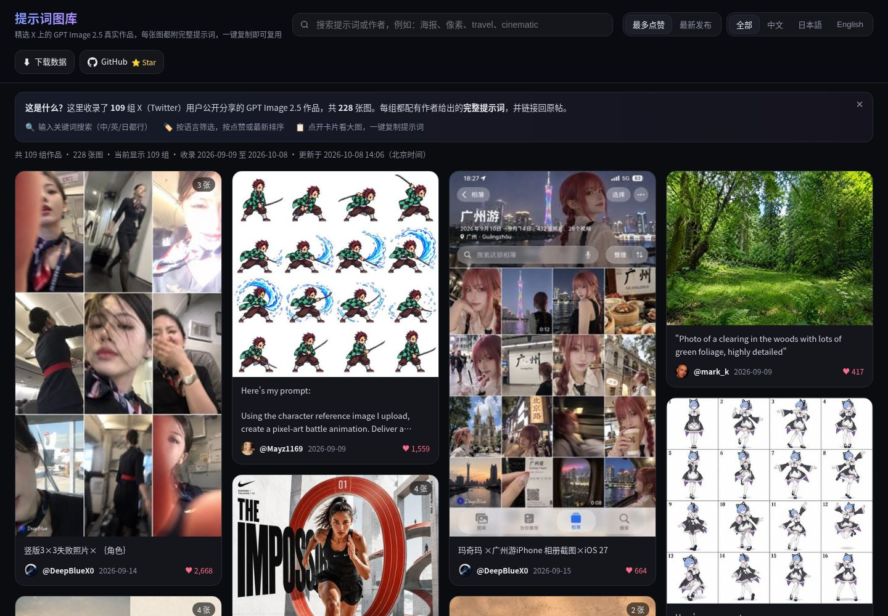

<div align="center">

# GPT Image 2.5 Prompt Gallery

**Real GPT Image 2.5 images shared on X, each with its full prompt. Search, filter, copy in one click.**

[**🌐 Live demo**](https://bin0754.github.io/gpt-image-gallery/) · [⬇ Download data](#download) · [🔁 Refresh the data](#refresh--reproduce) · [中文](README.md)

</div>

> Unofficial community project, not affiliated with OpenAI. Images and prompts belong to their original authors; every entry links back to the original post on X. The site UI is in Chinese (with English/Japanese content).



## Features

- Masonry gallery (dark theme; 2 columns on phones), lazy-loaded thumbnails.
- Lightbox with the large image (multi-image carousel), the **full prompt** and a one-click **copy** button, image download, and a link to the original post.
- Keyword search (prompt or author), language filter (中文 / 日本語 / English), sort by likes or newest.
- Downloads: `prompts.json`, `prompts.csv` (UTF-8 with BOM for Excel), full `data.json`, and a release ZIP that includes an offline single-file `gallery.html`.
- Static site on GitHub Pages: no backend, no tracking.

## Dataset

| | |
| --- | --- |
| Posts | **153** from 82 authors |
| Images | **311** (JPEG, max 1200px, plus 480px thumbnails) |
| Date range | 2026-09-09 to 2026-10-09 (UTC+8); GPT Image 2.5 launched around 2026-09-08 |
| Prompt language | English 127, Chinese 20, Japanese 4, other 2 |
| Prompt source | post text 74, author's own reply 64, image ALT text 15 |
| Last updated | 2026-10-09 14:36 (UTC+8) |

Inclusion rules: the post has images, mentions GPT Image 2.5, and the **author publicly shared the prompt** (in the post, in their own reply in the same thread, or in the image ALT text). Prompts that only exist inside an image or behind a link are skipped. Duplicates are removed, and NSFW or overly suggestive posts are not shown. Some posts compare several models, so not every image is from GPT Image 2.5. Some prompts are templates with placeholders.

## Download

| File | Contents |
| --- | --- |
| [`prompts.json`](https://bin0754.github.io/gpt-image-gallery/prompts.json) | `id, prompt, author, author_url, post_url, date (UTC+8 ISO 8601), likes, language, images[], prompt_source` |
| [`prompts.csv`](https://bin0754.github.io/gpt-image-gallery/prompts.csv) | Same, as CSV (UTF-8 BOM); `images` joined with ` \| ` |
| [`data.json`](https://bin0754.github.io/gpt-image-gallery/data.json) | Full records incl. original post text, avatar, reposts/bookmarks, image sizes |
| [ZIP (latest release)](https://github.com/Bin0754/gpt-image-gallery/releases/latest/download/gpt-image-gallery.zip) | Site + all images + data + scripts + offline `gallery.html` |

## Run locally

```bash
git clone https://github.com/Bin0754/gpt-image-gallery.git && cd gpt-image-gallery
python3 -m http.server 8080   # open http://localhost:8080/
```

## Refresh / reproduce

The data comes from **X API v2 search** (full-archive `search/all`). With your own X API access:

```bash
pip install -r scripts/requirements.txt
export X_BEARER_TOKEN=...
python3 scripts/fetch_x.py        # search -> raw/*.txt (full archive needs Pro/Enterprise; --recent = last 7 days)
python3 scripts/scrape.py         # extract prompts, dedupe, download/resize images -> data.json
python3 scripts/build_site.py     # -> index.html, prompts.json, prompts.csv, gallery.html
```

Queries and request fields are in [`scripts/queries.json`](scripts/queries.json). For example, `("gpt image 2.5" OR "gpt-image-2.5" OR gptimage2.5 OR gptimage25 OR "gptimage 2.5") prompt has:images -is:retweet`, plus multilingual variants (提示词 / プロンプト), `"prompt:"` inline variants, `lang:zh` / `lang:ja` variants, and author self-reply lookups: `((from:user (conversation_id:…)) OR …) is:reply -has:mentions`. Fields requested: `expansions=attachments.media_keys,author_id,referenced_tweets.id`, `media.fields=url,preview_image_url,type,width,height,alt_text`, `post.fields=created_at,public_metrics,note_tweet,entities,lang,conversation_id,referenced_tweets,attachments,in_reply_to_user_id,author_id`, `user.fields=username,name,profile_image_url`. Extraction rules: [`scripts/extract.py`](scripts/extract.py).

## Contributing

Suggest a post with [Submit a prompt](https://github.com/Bin0754/gpt-image-gallery/issues/new?template=submit-prompt.yml), report problems via [Issues](https://github.com/Bin0754/gpt-image-gallery/issues), or send a PR. See [CONTRIBUTING.md](CONTRIBUTING.md) (in Chinese).

## License, copyright & takedown

- **Code** (`scripts/`, page template and styles) is licensed under [MIT](LICENSE), © 2026 Bin0754.
- **Images and prompts are not covered by the MIT license.** They were published on X by their original authors, who keep all rights. This project only indexes them with attribution and a link to each original post. Contact the author before reusing their work.
- **Takedown:** if you are an author and want your content removed, [open a removal request](https://github.com/Bin0754/gpt-image-gallery/issues/new?template=removal-request.yml) with the post link. It will be removed promptly and excluded from future updates.
- "GPT Image", "ChatGPT" and "OpenAI" are trademarks of OpenAI. This project is not affiliated with, sponsored or endorsed by OpenAI or X Corp.
