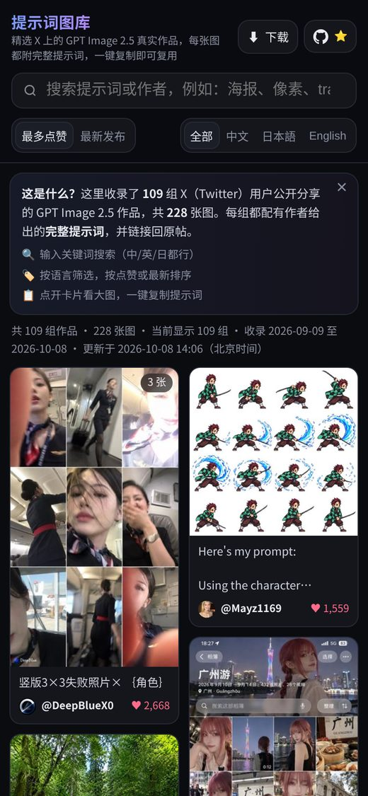

<div align="center">

# GPT Image 2.5 提示词图库

**精选 X 上的 GPT Image 2.5 真实作品，每张图都附完整提示词——搜索、筛选、一键复制。**

[**🌐 在线浏览**](https://bin0754.github.io/gpt-image-gallery/) · [⬇ 下载数据](#-下载数据) · [🔁 刷新数据](#-刷新--复现数据) · [English](README.en.md)

  

</div>

> 非官方社区整理项目，与 OpenAI 无任何关联。图片与提示词版权归各原作者所有，每条内容都链接回 X 原帖。

## 📸 截图

| 桌面端 | 手机端 |
| --- | --- |
|  |  |

## ✨ 功能

- **瀑布流图库**：深色界面，桌面多列、手机两列，图片懒加载，打开即用。
- **完整提示词**：点开卡片看大图（多图可左右切换），旁边就是作者原始提示词，**一键复制**。
- **搜索 & 筛选**：按关键词（提示词或作者，中/英/日均可）搜索，按语言筛选，按点赞数或发布时间排序。
- **溯源**：每条都显示作者、发布时间（北京时间）、点赞/转发/收藏数，并可跳转 X 原帖。
- **下载**：单张图片下载；全部提示词可导出 JSON / CSV（Excel 直接打开）；完整打包 ZIP 含离线单文件版。
- **纯静态**：无后端、无追踪，GitHub Pages 托管；也可以下载后本地打开。

## 📊 数据集

| 项目 | 数值 |
| --- | --- |
| 作品（帖子） | **153** 组，来自 82 位作者 |
| 图片 | **311** 张（最长边 1200px JPEG + 480px 缩略图） |
| 发布时间范围 | 2026-09-09 至 2026-10-09（北京时间，GPT Image 2.5 于 2026-09-08 前后发布） |
| 提示词语言 | English 127，中文 20，日本語 4，其他 2 |
| 提示词来源 | 帖子正文 74 · 作者本人回复 64 · 图片 ALT 文本 15 |
| 最近更新 | 2026-10-09 14:36（北京时间） |

收录规则：帖子须带图片、明确提到 GPT Image 2.5，并且能拿到**作者本人公开给出的提示词**（帖子正文 / 作者在同一会话中的自回复 / 图片 ALT 文本）。提示词“只在图片里”或“在评论区/链接里”的帖子不收录；同一作者的重复提示词去重；NSFW 及过于性感的内容不在公开页面展示。

注意：部分帖子是多个模型的对比图，图片中可能包含其他模型的结果；部分提示词是带 `[城市]`、`{角色}` 等占位符的模板。

## ⬇ 下载数据

| 文件 | 说明 |
| --- | --- |
| [`prompts.json`](https://bin0754.github.io/gpt-image-gallery/prompts.json) | 精简数据：`id, prompt, author, author_url, post_url, date (UTC+8 ISO), likes, language, images[], prompt_source` |
| [`prompts.csv`](https://bin0754.github.io/gpt-image-gallery/prompts.csv) | 同上，UTF-8 带 BOM，Excel 打开中文不乱码；`images` 列用 ` \| ` 分隔 |
| [`data.json`](https://bin0754.github.io/gpt-image-gallery/data.json) | 完整数据：含原帖正文、头像、转发/收藏数、图片尺寸等 |
| [全部打包 ZIP](https://github.com/Bin0754/gpt-image-gallery/releases/latest/download/gpt-image-gallery.zip) | 最新 Release：网页 + 全部图片 + 数据 + 脚本 + `gallery.html`（离线单文件版，双击即可浏览） |

`prompts.json` 示例：

```json
{
  "id": "2099481521983995971",
  "prompt": "竖版3×3失败照片× ｛角色｝",
  "author": "DeepBlueX0",
  "author_url": "https://x.com/DeepBlueX0",
  "post_url": "https://x.com/DeepBlueX0/status/2099481521983995971",
  "date": "2026-09-14T20:52:55+08:00",
  "likes": 2668,
  "language": "zh",
  "images": ["images/2099481521983995971_0.jpg", "..."],
  "prompt_source": "post"
}
```

`prompt_source`：`post` = 帖子正文，`reply` = 作者本人回复，`alt` = 图片 ALT 文本。`likes` 为采集时的数值。

## 💻 本地运行

```bash
git clone https://github.com/Bin0754/gpt-image-gallery.git
cd gpt-image-gallery
python3 -m http.server 8080
# 浏览器打开 http://localhost:8080/
```

不想装任何东西？下载 [ZIP](https://github.com/Bin0754/gpt-image-gallery/releases/latest/download/gpt-image-gallery.zip) 解压后双击 `gallery.html`（图片已内嵌）或 `index.html` 即可。

## 🔁 刷新 / 复现数据

数据来自 **X API v2 搜索**（维护者通过 X API 的全量历史搜索 `search/all` 采集）。你可以用自己的 X API 权限完整复现：

```bash
pip install -r scripts/requirements.txt          # Pillow, requests
export X_BEARER_TOKEN=你的_X_API_Bearer_Token
python3 scripts/fetch_x.py            # ① 搜索 → raw/*.txt（全量搜索需 Pro/Enterprise；加 --recent 只搜最近 7 天）
python3 scripts/scrape.py             # ② 解析 + 提取提示词 + 去重 + 下载/压缩图片 → data.json, images/, thumbs/
python3 scripts/build_site.py         # ③ 生成 index.html, prompts.json, prompts.csv, gallery.html
python3 -m http.server 8080           # ④ 本地预览
```

`fetch_x.py --dry-run` 可只打印将要发出的请求。

**查询集**（完整列表见 [`scripts/queries.json`](scripts/queries.json)，起始时间 2026-09-08）：

| 名称 | 排序 | 查询 |
| --- | --- | --- |
| q01 | relevancy | `("gpt image 2.5" OR "gpt-image-2.5" OR "gptimage2.5" OR "gpt-image 2.5") has:images -is:retweet` |
| q02 / q04 | relevancy ×2 页 / recency ×4 页 | `("gpt image 2.5" OR "gpt-image-2.5" OR gptimage2.5 OR gptimage25 OR "gptimage 2.5") prompt has:images -is:retweet` |
| q03 | relevancy ×2 页 | 上述名称 + `(提示词 OR プロンプト OR "prompt:" OR "Prompt 👇" OR "prompt below" OR "prompt in alt")` |
| q05 | relevancy ×3 页 | 上述名称 + `("prompt:" OR "提示词：") has:images -is:retweet -is:reply` |
| q06 / q07 | relevancy | 中文 `lang:zh (提示词 OR prompt OR 咒语)` / 日文 `lang:ja (プロンプト OR prompt)` |
| q09 | relevancy，按时间窗口拆分 | “正文给出提示词或提示词在下方” 的合并查询 |
| 自回复 | recency | `((from:作者 (conversation_id:… OR …)) OR …) is:reply -has:mentions`——给“Prompt below 👇”类帖子取作者本人回复 |

**请求字段**：

```
expansions   = attachments.media_keys,author_id,referenced_tweets.id
media.fields = url,preview_image_url,type,width,height,alt_text
post.fields  = created_at,public_metrics,note_tweet,entities,lang,conversation_id,referenced_tweets,attachments,in_reply_to_user_id,author_id
user.fields  = username,name,profile_image_url
```

提示词提取规则在 [`scripts/extract.py`](scripts/extract.py)：优先取正文中 `Prompt:` / `提示词：` / `プロンプト：` 之后的文字（会跳过“3️⃣ Paste the prompt 4️⃣ Generate”这类步骤说明）；否则用图片 ALT 文本；否则用作者在同一会话里的自回复（跳过视频提示词、链接、闲聊）。`build_site.py` 里的 `INCLUDE_NSFW` / `HIDE_IDS` 控制公开页面的内容过滤。

> 维护者发布流程：`python3 scripts/scrape.py && python3 scripts/build_site.py && scripts/publish.sh`。`build_site.py` 会把公开内容导出到本地 `site/`（即本仓库的工作副本），`publish.sh` 提交并推送，GitHub Pages 约 1–3 分钟后更新。新版本打包：`python3 scripts/build_site.py --release-zip` 后用 `gh release create` 上传 `gpt-image-gallery.zip`。

## 🗂 项目结构

```
.
├── index.html            # 网站（由 scripts/template.html + data.json 生成）
├── data.json             # 完整数据
├── prompts.json / .csv   # 精简下载数据
├── images/  thumbs/      # 图片（≤1200px）与缩略图（≤480px）
├── favicon.svg  apple-touch-icon.png
├── docs/                 # README 截图
├── scripts/
│   ├── fetch_x.py        # X API v2 搜索 → raw/*.txt
│   ├── queries.json      # 查询集与请求字段
│   ├── scrape.py         # raw → data.json + 下载图片
│   ├── extract.py        # 提示词提取 / 清洗 / 去重
│   ├── build_site.py     # 生成网页与下载文件
│   ├── template.html     # 页面模板（样式与交互）
│   ├── publish.sh        # 维护者：推送到 GitHub Pages
│   └── requirements.txt
├── .github/ISSUE_TEMPLATE/   # 推荐提示词 / 移除请求
├── CONTRIBUTING.md
└── LICENSE               # MIT（仅代码）
```

## 🤝 参与贡献

- **推荐好作品**：[提交提示词](https://github.com/Bin0754/gpt-image-gallery/issues/new?template=submit-prompt.yml)，贴上 X 原帖链接即可（需作者公开了提示词）。
- **报错 / 建议**：提示词提取有误、分类不对、页面问题，欢迎开 [Issue](https://github.com/Bin0754/gpt-image-gallery/issues)。
- **改进代码**：欢迎 PR（页面交互、提取规则、多语言等）。详见 [CONTRIBUTING.md](CONTRIBUTING.md)。

## ⚖️ 许可与版权

- **代码**（`scripts/`、页面模板与样式）以 [MIT 协议](LICENSE) 开源，© 2026 Bin0754。
- **图片与提示词不属于本项目**：它们由各原作者在 X 上公开发布，版权归原作者所有，**不适用 MIT 协议**。本项目仅做整理与索引，每条内容都标明作者并链接到原帖。如需商用或转载作品，请联系原作者。
- **移除请求**：如果你是作者并希望移除自己的内容，请[提交移除请求](https://github.com/Bin0754/gpt-image-gallery/issues/new?template=removal-request.yml)（附上原帖链接），我们会尽快删除，并在下次更新时不再收录。
- “GPT Image”“ChatGPT”“OpenAI” 是 OpenAI 的商标。本项目为非官方社区作品，与 OpenAI 及 X Corp. 无任何关联、赞助或背书关系。
